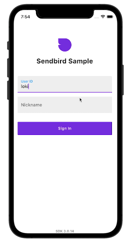
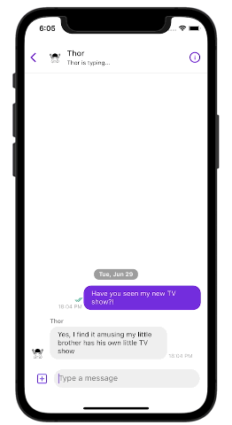

# [Sendbird](https://sendbird.com) Chat SDK Sample for Flutter

This sample demonstrates how you can use [Sendbird's Flutter SDK](https://github.com/sendbird/sendbird-sdk-flutter) in your own Flutter application. Sendbird provides an easy-to-use Chat API, Chat SDKs, and a fully-managed chat platform on the backend that provides delivery receipts, offline messaging, presence, translation, moderation tools, and analytics.

 

## Table of contents

  1. [Introduction](#introduction)
  1. [Requirements](#requirements)
  1. [Getting started](#getting-started)
  1. [Getting help](#getting-help)
  1. [Hiring](#we-are-hiring)

 

## Introduction

This sample consists of several features, including:

* Connecting and disconnecting from Sendbird 
* Create / fetch / update a group channel  
* Send / update / delete a message (user and file message)
* Receive channel events and handle appropriately
* Push notification 

 

 

## Requirements

The minimum requirements for this demo are:

- Xcode or Android studio 
- Dart 2.13.0
- Flutter 2.0.0 or higher

 

## Getting started

This sample demonstrates a few example how you can use SDK on your application. The sample consists of the following:

* Connect and disconnect from Sendbird 
* Create / fetch / update a group channel  
* Send / update / delete a message (user and file message)
* Receive channel events and handle appropriately
* Push notification 

You can either download or clone this repository then run `flutter run` in the directory to run the sample.

 

## Getting Help
Check out the Official Sendbird [Flutter docs](https://sendbird.com/docs/chat/v3/flutter/quickstart/send-first-message?&utm_source=github&utm_medium=referral&utm_campaign=repo&utm_content=sendbird-chat-flutter-sample) and Sendbird's [Developer Portal](https://sendbird.com/developer) for tutorials and videos. If you need any help in resolving any issues or have questions, visit our [community forums](https://community.sendbird.com?&utm_source=github&utm_medium=referral&utm_campaign=repo&utm_content=sendbird-chat-flutter-sample).

 

## We are Hiring!
Sendbird is made up of a diverse group of humble, friendly, and hardworking individuals united by a shared purpose to build the next generation of mobile & social technologies. Join our team remotely or at one of our locations in San Mateo, Seoul, New York, London, and Singapore. More information on a [careers page](https://sendbird.com/careers?&utm_source=github&utm_medium=referral&utm_campaign=repo&utm_content=sendbird-chat-flutter-sample).
